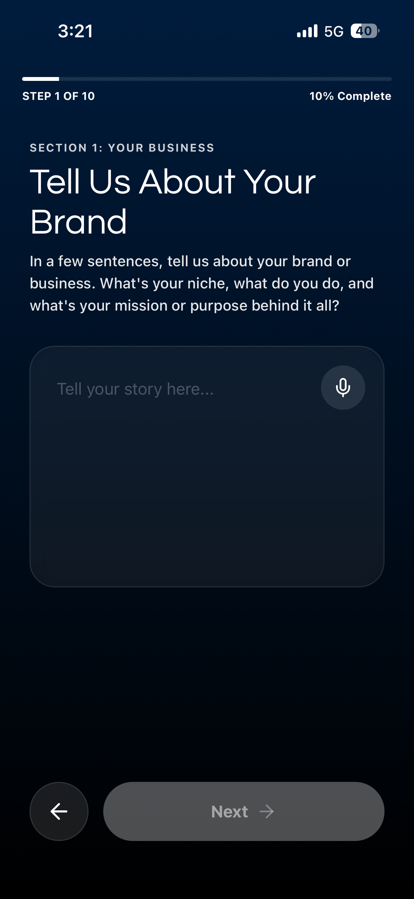
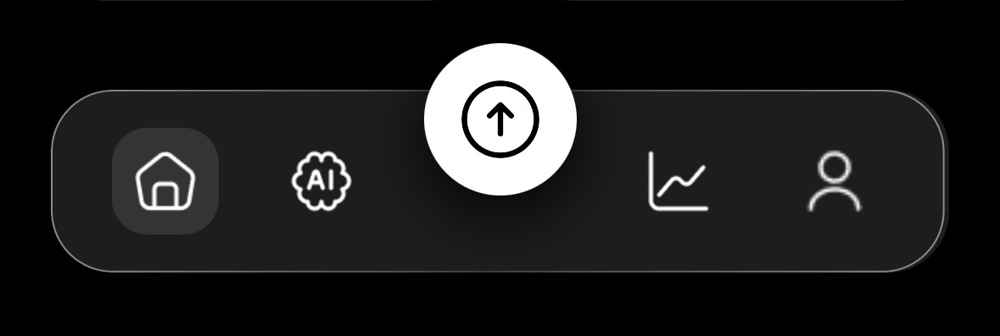
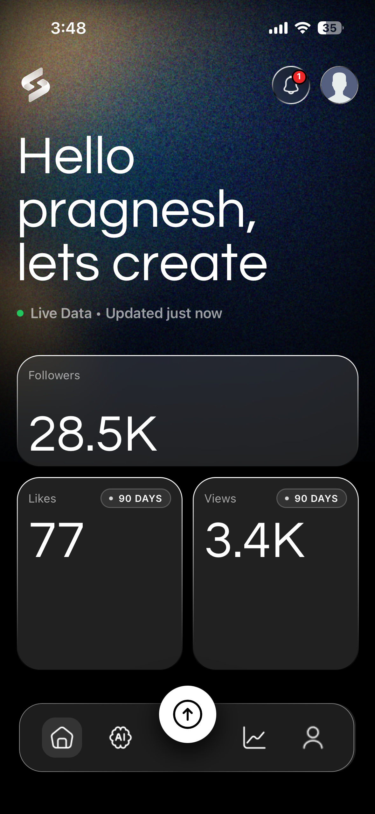
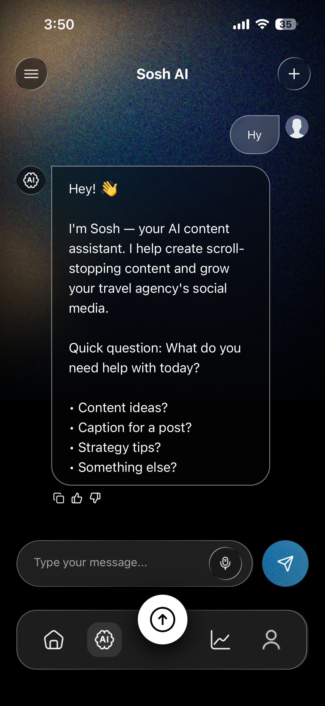
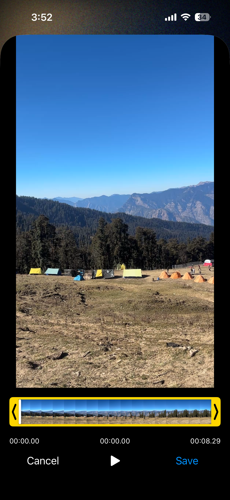
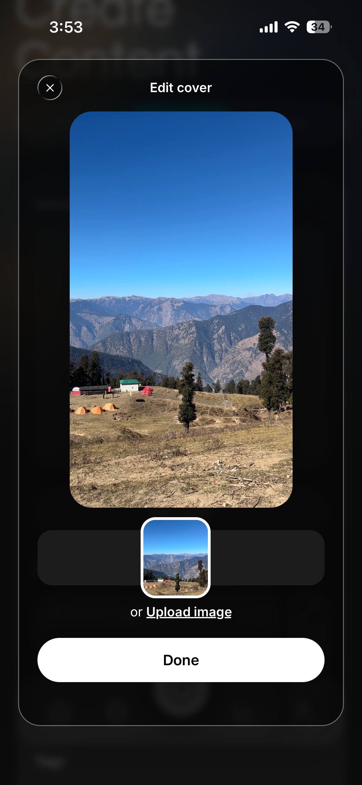
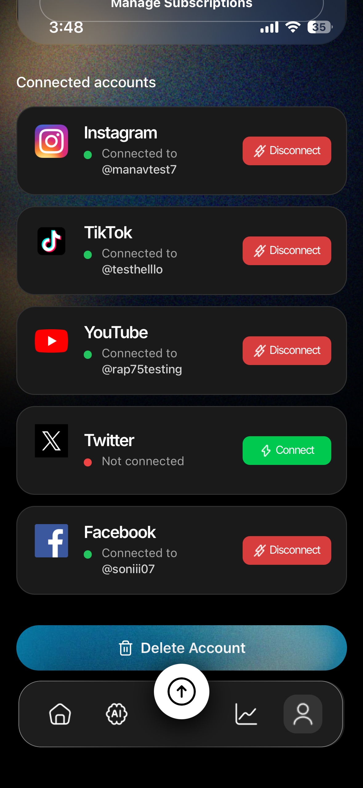
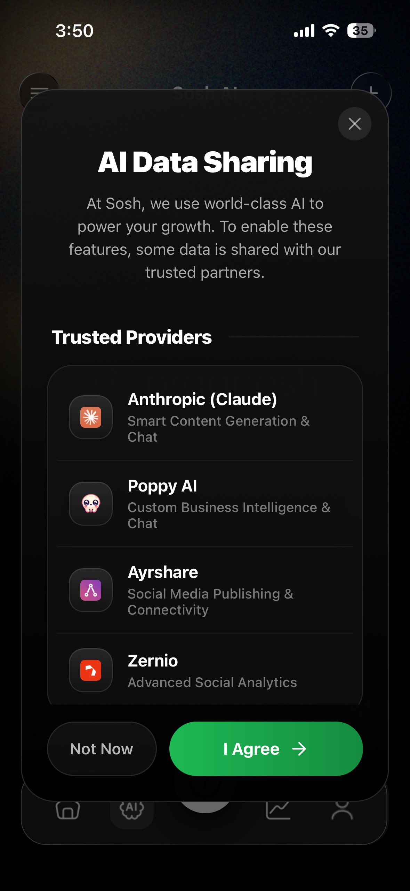

# Sosh Detailed User Manual

Welcome to **Sosh**! Sosh is your ultimate AI-powered social media companion. This comprehensive user manual will guide you through all the features and capabilities of the Sosh App, from setting up your account to mastering our advanced AI and analytics tools.

---

## Table of Contents
1. [Getting Started](#1-getting-started)
2. [Navigating the App](#2-navigating-the-app)
3. [Home & Dashboard](#3-home--dashboard)
4. [AI Chat & Custom Brand AI](#4-ai-chat--custom-brand-ai)
5. [Creating & Scheduling Content](#5-creating--scheduling-content)
6. [Analytics & Insights](#6-analytics--insights)
7. [Profile & Settings](#7-profile--settings)
8. [Subscription Plans in Detail](#8-subscription-plans-in-detail)
9. [Troubleshooting & Support](#9-troubleshooting--support)

---

## 1. Getting Started

### Account Creation & Onboarding Questionnaire
When you first open Sosh, you can sign up using your email and a secure password. During your first login, you will go through our comprehensive **Onboarding Questionnaire**. This is a critical step that allows our Custom AI to deeply understand your brand and generate highly personalized content tailored specifically to you. 

The questionnaire covers 10 key areas:
1. **Your Brand**: A brief description of your niche, business, and mission.
2. **Your Audience**: The age range and a description of your ideal follower.
3. **Your Social Media Presence**: The platforms you use and your primary goals (e.g., gaining followers, getting clients).
4. **Your Brand Personality**: Up to 5 traits that define your brand (e.g., Fun/Playful, Professional/Polished, Witty/Sarcastic).
5. **Your Content Style**: The types of content you post (e.g., Tutorials, Vlogs, Behind the Scenes) and what makes you unique.
6. **The Feeling You Create**: How you want your audience to feel when they consume your content (e.g., Inspired, Entertained, Motivated).
7. **Your Language and Boundaries**: Specific slang or catchphrases you use, as well as topics you absolutely want to avoid.
8. **Your Competitive Landscape**: Who your competitors are, what they do well, and how you differentiate yourself.
9. **Caption Style**: Your preferred caption length (short & punchy vs. long-form) and your stance on emoji usage.
10. **How You Engage**: How you prefer to close out your posts (e.g., asking a question, a call-to-action) and the general tone of your caption bodies.

**How This Data Is Used:** 
Your answers are saved securely to your profile and act as the foundational context for the Custom AI (available in Pro and Business tiers). Whenever you use the AI to generate a caption, brainstorm ideas, or write a script, the AI references these exact preferences. This ensures that every piece of content generated sounds genuinely like *you*, rather than a generic robot.

You can update or edit your answers at any time by going to the **Profile** tab and selecting **Edit Questionnaire**.

### Connecting Your Social Accounts
To get the most out of Sosh, you need to connect your social media profiles.
- Go to the **Profile** tab.
- Select **Linked Accounts**.
- Follow the prompts to securely connect your Instagram, TikTok, YouTube, Facebook, and X (Twitter) accounts. 
- *Business users* can also connect Snapchat.

---

## 2. Navigating the App

Sosh is organized into 5 primary tabs located at the bottom of your screen:

- **Home**: Your central dashboard and overview.
- **AI**: Your personalized AI chat assistant for brainstorming and strategy.
- **Create Content**: The studio where you design, write, and schedule posts.
- **Analysis**: Deep-dive analytics for your connected platforms.
- **Profile**: Manage your account, subscriptions, and settings.

---

## 3. Home & Dashboard

The **Home** tab is your command center. 

Here you will see:
- A quick summary of your upcoming scheduled posts.
- Alerts and notifications regarding content that needs your attention.
- Quick action buttons to start a new post or chat with the AI.

---

## 4. AI Chat & Custom Brand AI

Sosh integrates powerful AI (powered by Anthropic Claude & **Poppy AI**) to act as your digital co-creator. 

### What is Poppy AI?
**Poppy AI** is our specialized Custom Business Intelligence engine designed for Sosh's Premium and Business tiers. While standard AI models give generic answers, Poppy AI serves as a hyper-personalized brain tailored directly to your brand. 

**What Poppy AI Does:**
- **Real-Time Streaming Chat**: Poppy powers the rapid, real-time conversational AI in the **AI** tab, allowing you to fluidly brainstorm and strategize without lag.
- **Bespoke Board Integration**: For Sosh Business users, Poppy AI can be wired to a custom "Board" and "Chat ID" trained specifically by experts on your entire company's data, products, and historical performance.
- **Credit Tracking**: Poppy AI token usage is automatically tracked behind the scenes. If you are on the Business plan, you have unlimited credits to utilize Poppy's advanced intelligence.

### Using the AI Chat
In the **AI** tab, you can chat with your AI assistant. 

Use this feature to:
- Brainstorm content ideas for the week.
- Ask for viral hook suggestions.
- Generate scripts for short-form videos (Reels/TikToks).

### Custom AI Trained on Your Brand (Pro & Business)
If you are on a Pro or Business plan, the AI doesn't just give generic advice—it learns your brand. By analyzing your past posts and the preferences you set during the onboarding questionnaire, the AI mimics your specific tone of voice, ensuring all generated captions sound exactly like you.

---

## 5. Creating & Scheduling Content

The **Create Content** tab is where the magic happens. Sosh allows you to create posts tailored for each platform simultaneously.

### Step-by-Step Post Creation
1. **Upload Media**: Tap to upload photos or videos. Our app supports high-quality images and short-form video formats suitable for Reels, Shorts, and TikToks.

   

2. **Video Cutting & Trimming**: If you uploaded a video, use our built-in video editor to precisely cut and trim your clips to the perfect length.

   

3. **Custom Thumbnails**: Select the perfect frame from your video or upload a custom image to serve as your thumbnail, ensuring your posts stand out.

   

4. **Platform Preview**: Before finalizing, use the Preview feature to see exactly how your post will look natively on each platform (Instagram, TikTok, YouTube, etc.) to ensure your formatting is perfect.
5. **Generate Smart Captions**: Tap the AI button to generate captions. Sosh will automatically create platform-specific variations (e.g., a short, punchy caption with hashtags for Instagram, and a conversational thread-style caption for X).
6. **Review & Edit**: You can manually tweak the AI-generated captions or regenerate them if needed.
7. **Schedule or Post Now**: Choose to publish the post immediately to your connected platforms, or use the calendar to schedule it for an optimal future date.

---

## 6. Analytics & Insights

Understanding your performance is key to growth. The **Analysis** tab aggregates data from all your connected accounts.

- **Free Plan**: View basic engagement metrics (likes, comments, shares) for recent posts.
- **Pro Plan (90-Day Analytics)**: Track your growth, reach, and engagement over the past 90 days. See which platforms are performing best and identify trends in your content.
- **Business Plan (Deeper Analytics)**: Gain insights that go beyond just Sosh-managed posts. Sosh Business pulls in broader platform analytics, giving you a complete holistic view of your digital footprint.

---

## 7. Profile & Settings

In the **Profile** tab, you can:

- **Edit Your Profile**: Update your name, profile picture, and bio.
- **Manage AI Credits**: See how many AI chats and captions you have remaining for the month. *(Note: Credits reset every 30 days based on your subscription date).*
- **Subscription Management**: View your current plan, upgrade to Premium, or restore past purchases.
- **App Preferences**: Toggle push notifications and UI settings.

---

## 8. Subscription Plans in Detail

Sosh offers three tiers to match your needs:

### 1. Free Plan
The perfect starting point for new creators.
- Basic AI Chat & Captions (limited monthly credits).
- Basic posting capabilities.
- Standard community support.

### 2. Sosh Pro
Built for serious creators and professionals who need scale.
- **500 AI Chats & Captions per month**: Never run out of ideas.
- **Custom AI**: Trained specifically on your brand voice.
- **Cross-Platform**: Post to IG, TT, YT, FB, and X.
- **Advanced Tools**: Scheduling, video/reel tools, and smart platform-specific captions.
- **90-Day Analytics**: Comprehensive cross-platform tracking.

### 3. Sosh Business
The ultimate powerhouse for agencies and large brands.
- **Everything in Pro, plus:**
- **No Hard Limits***: Unlimited AI chat and caption generation.
- **Expert Custom AI**: We hand-build and refine your custom AI model.
- **Snapchat Integration**: Post directly to Snapchat.
- **Deeper Analytics**: Full-scope data tracking.
- **Team Seats & 24/7 Support**: Priority routing and team collaboration.

> **Fair Use Policy*: Usage has no hard limits for normal everyday use. We monitor for automated activity, resale, or abuse and may apply reasonable limits on extreme, non-typical use.

---

## 9. Troubleshooting & Support

- **Purchases Not Showing Up?** Go to the Profile Tab > Sosh Premium, and tap **Restore Purchases**. This will sync your App Store receipt with our servers.
- **Notifications Not Working?** Ensure you have granted Sosh permission to send Push Notifications in your device settings.
- **Need Further Help?** Business users can access 24/7 support directly via the Profile tab. Free and Pro users can access our detailed help center or community forums.
